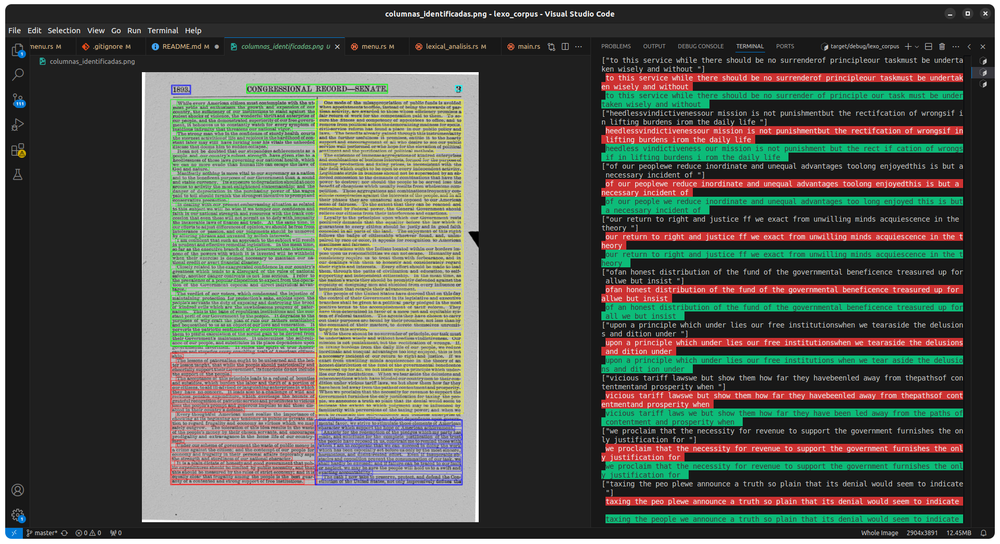
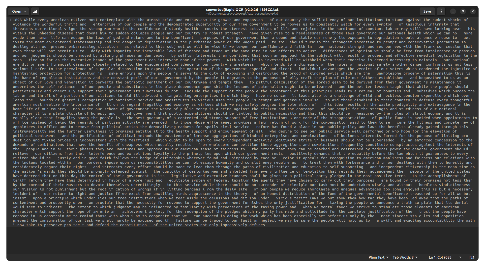
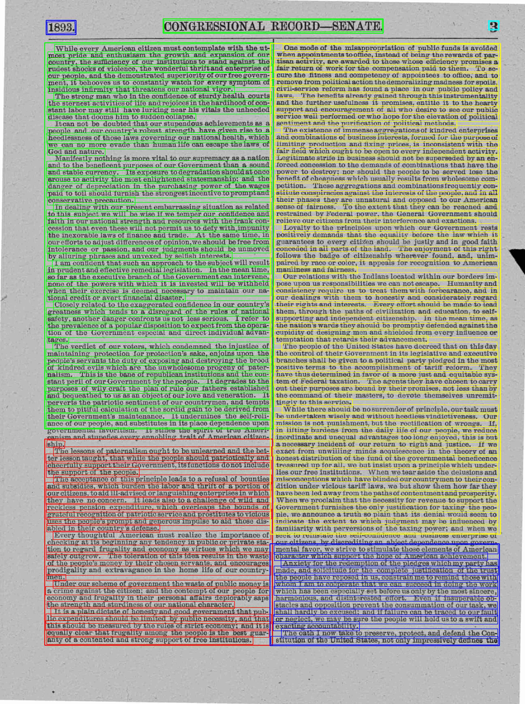
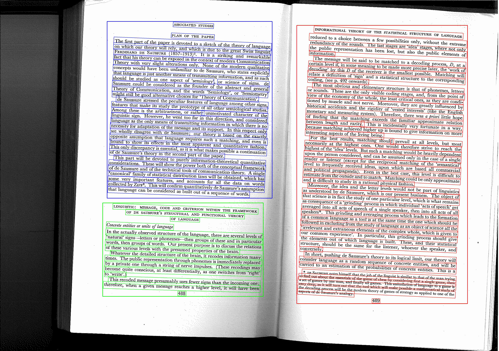

# Lexo Corpus PR

## Descripción

El proposito del proyecto es el analisis de corpus producto del contenido extraido de los documentos con formato 'txt' y 'pdf'.
Cuenta con el analisis automatizado de grandes volumenes de texto presentes en documentos, obteniendo como resultados graficas y listas de palabras relevantes en 'csv'.

## Características

Funcionalidades a detalle

- ✅ Obtención del recuento total de palabras presentes en un corpus (texto extraido del documento)
- ✅ Obtención del recuento de los 50 mas frecuentes palabras presentes en un corpus (texto extraido del documento)
- ✅ Obtención del recuento de las distancias totales de cada inter-word (palabras especificas de interes) presentes en un corpus (texto extraido del documento)
- ✅ Elaboración grafica de la ley de zipf ya sea para cada documento ó dataset
- ✅ Elaboración grafica de la ley de heaps ya sea para cada documento ó dataset
- ✅ Elaboración heatmap de las inter-word de interes para cada documento ó dataset
- ✅ Procesar corpus para diferentes casos presentes en documentos pdf (texto plano, ó mediante extracción de texto en imagenes)
- ✅ Acceso a la API de la libreria externa
- ✅ Acceso a la API de Tesseract OCR (Version 5.4.1 con Leptonica-1.82)
- ✅ Acceso parcial a la API de Rapid OCR (Version 2.0.2) con ONNX Runtime (CPU)
- ✅ Analisis sintactico con Symspell (mediante Bigramas y Unigramas **lang: EN**)

## Tecnologías Utilizadas

- _Requerido_ [Rust](https://www.rust-lang.org/tools/install)
- _Requerido_ [Python (v3.8+)](https://www.python.org/downloads/)
- _**Opcional**_ [Tesseract OCR](https://tesseract-ocr.github.io/tessdoc/Installation.html)
- _Requerido_ [Rapid OCR](https://github.com/RapidAI/RapidOCR)
- _~~**Opcional**~~ (Eliminado por Memory Leak)_ [Paddle OCR](https://github.com/PaddlePaddle/PaddleOCR)
- _**Integrado en el proyecto**_ [Symspell](https://github.com/wolfgarbe/SymSpell) mediante [Wrapper para Rust](https://github.com/wolfgarbe/SymSpell)

## Dependencias Requeridas

Instalar gcc compiler (varia según el sistema operativo, para ubuntu viene empaquetado en build-essential).
Instalar las librerias de desarrollo python-dev para establecer la interacción entre ambos lenguajes (python-rust binding) y herramientas de OCR

- [UBUNTU]

  - sudo apt install build-essential
  - sudo apt install python3-dev

  - _**Opcional**_ [Tesseract OCR]
    - sudo apt install tesseract-ocr
    ***
    #### ⚠️ A tener en cuenta (Tesseract v5)
    Se requiere primero añadir el PPA al /etc/apt/source.list para que el OS tenga permitido acceder al repositorio. Realizar lo siguiente:
    - sudo add-apt-repository ppa:alex-p/tesseract-ocr5
    - sudo apt update
    ***

## ⚠️ Nota importante ⚠️

Como la compilación y construcción del binario se realizo en Linux (Ubuntu 22.04) el binario no
tendra complicaciones de ejecución si es ejecutado bajo el mismo OS o distro similar de Linux.

Si no esta utilizando Ubuntu 22.04 o superior se recomienda el primer metodo, donde se elabora y construye
el binario con las dependencias de su sistema gracias al empaquetador de Rust (Cargo), este binario generado sera ejecutado sin problemas en su OS y sera compatible
con su OS (Windows, macOS, etc.).

Caso contrario es libre de utilizar el segundo metodo o el de su preferencia.

## Instalación

1. Clona este repositorio:

   ```bash
   git clone https://github.com/vlzcrz/lexo_corpus.git
   cd repositorio
   ```

2. Crea el virtual env de python para este proyecto (con el nombre: 'lexo_corpus_env'):

   ```bash
   python3 -m venv lexo_corpus_env
   ```

3. Activa el entorno virtual y instala las dependencias de python para este proyecto:

   Activar el venv:

   ```bash
   source lexo_corpus_env/bin/activate
   ```

   Instala dependencias python:

   ```bash
   pip install maturin
   ```

   ```bash
   pip install --upgrade pymupdf
   ```

   ```bash
   pip install numpy matplotlib seaborn
   ```

   ***

   #### ⚠️ A tener en cuenta (Rapid OCR)

   **Rapid OCR** esta basado en **Paddle OCR** pero utilizando un runtime alternativo **(ONNX Runtime)** y evita memory leaks al identificar los textos de imagenes con resoluciones altas (DPI).

   CPU

   ```bash
   pip install rapidocr
   ```

   ```bash
   pip install rapidocr_onnxruntime
   ```

   ***

   #### Opcional

4. Copiar y pegar la carpeta completa de la libreria externa TET:

   - Renombra la carpeta TET-5.6... a 'tetlib'
   - Traslada la carpeta 'tetlib' adentro de la carpeta 'python' presente en el proyecto

   ***

   #### Finalmente

5. Crea las siguientes carpetas en la raiz del proyecto:

   - "books-pdf" (carpeta donde almacenaras los pdf a analizar)
   - "books-txt" (carpeta donde almacenaras los txt a analizar)
   - "labeled-data-singular" (carpeta donde se almacenan los csv para automatizar el analisis de varios documentos con su año para un presidente).
     Ej:

   ```csv
   document,year
   joe-biden-1.txt,2025
   joe-biden-2.txt,2024
   ```

   - "labeled-data-multiple" (carpeta donde se almacenan los csv para automatizar el analisis de varios documentos con su año para varios presidentes).
     Ej:

   ```csv
   document,year,president
   joe-biden-1.txt,2025,Donald Trump
   joe-biden-2.txt,2024,Joe Biden
   ```

6. Iniciar el proyecto (con el venv activado):
   ```bash
   cargo run
   ```

## Ejecutando el binario

[UBUNTU]

1. Una vez descargado el binario, situelo dentro de una carpeta y de permisos de ejecución.

   ```bash
   mkdir lexo_corpus_dir
   sudo mv lexo_corpus /lexo_corpus_dir
   ```

   Acceda a la carpeta 'lexo_corpus_dir'

   ```bash
   cd lexo_corpus_dir
   ```

   Conceda permisos de ejecución

   ```bash
   sudo chmod +x /lexo_corpus_dir/lexo_corpus
   ```

2. Inicializar y activar el entorno virtual de python

   ```bash
   python3 -m venv lexo_corpus_env
   ```

   ***

   ⚠️ _En caso de error al crear el env deberá instalar el siguiente paquete de recursos. (La versión del paquete depende de la versión de ubuntu)_

   ```bash
   sudo apt install python3.10-venv
   ```

   ***

   Active y mantenga activado en todo momento el python environment

   ```bash
   source lexo_corpus_env/bin/activate
   ```

3. Instale las dependencias de python

   ```bash
   pip install --upgrade pymupdf
   ```

   ```bash
   pip install numpy matplotlib seaborn
   ```

   ```bash
   pip install rapidocr
   ```

   ```bash
   pip install rapidocr_onnxruntime
   ```

4. Crea las siguientes carpetas en lexo_corpus_dir:

   - "books-pdf" (carpeta donde almacenaras los pdf a analizar)
   - "books-txt" (carpeta donde almacenaras los txt a analizar)
   - "python" (carpeta donde almacenara la libreria externa)
   - "labeled-data-singular" (carpeta donde se almacenan los csv para automatizar el analisis de varios documentos con su año para un presidente).
     Ej:

   ```csv
   document,year
   joe-biden-1.txt,2025
   joe-biden-2.txt,2024
   ```

   - "labeled-data-multiple" (carpeta donde se almacenan los csv para automatizar el analisis de varios documentos con su año para varios presidentes).
     Ej:

   ```csv
   document,year,president
   joe-biden-1.txt,2025,Donald Trump
   joe-biden-2.txt,2024,Joe Biden
   ```

#### Opcional

5. Copiar y pegar la carpeta completa de la libreria externa TET:

   - Renombra la carpeta a TET-5.6... a 'tetlib'
   - Traslada la carpeta 'tetlib' adentro de la carpeta 'python' creada anteriormente

#### Finalmente

6. Iniciar el binario

   ```bash
   ./lexo_corpus
   ```

# Demostración PROYECTO LEXO CORPUS

## Procesamiento del corpus


## Procesamiento Imagen (Rapid OCR)





## Pruebas




